# 📐 Kahani Visual Diagrams

This document contains Mermaid.js diagrams that can be rendered in GitHub, VS Code, or any Mermaid-compatible viewer.

---

## System Context Diagram

```mermaid
graph TB
    User[👤 Storyteller] -->|Write Stories| Frontend
    Frontend[Next.js Frontend] -->|API Requests| Backend
    Backend[FastAPI Backend] -->|Vector Search| Milvus
    Backend -->|Generate Text| Groq[Groq LLM]
    Backend -->|Store Data| SQLite[(SQLite DB)]
    Backend -->|Future: Mint NFT| Blockchain
    Blockchain[Go Blockchain] -->|Store Content| IPFS
    Blockchain -->|Consensus| PBFT[PBFT Network]
    Blockchain -->|Persist State| BadgerDB[(BadgerDB)]
    
    style Frontend fill:#3b82f6,color:#fff
    style Backend fill:#10b981,color:#fff
    style Blockchain fill:#8b5cf6,color:#fff
    style Milvus fill:#f59e0b,color:#fff
    style Groq fill:#ef4444,color:#fff
```

---

## Component Architecture

---

## Story Creation Sequence Diagram

---

## Lore Extraction Flow

---

## NFT Minting Sequence (Future)

---

## PBFT Consensus Flow

---

## Data Model ER Diagram

---

## Deployment Architecture

---

## State Transition: Story Line Lifecycle

---

## State Transition: PBFT Block States

---

## Network Topology

---

## Class Diagram: Core Blockchain Types

---

## Technology Stack Layers

---

## Diagram Sources

All diagrams in this file are defined using [Mermaid.js](https://mermaid.js.org/) syntax for version control and easy editing.

For more architectural details, see:
- [`ARCHITECTURE.md`](./ARCHITECTURE.md) - Complete system design
- [`DATA_FLOW.md`](./DATA_FLOW.md) - Detailed DFD documentation
- [`BLOCKCHAIN.md`](./BLOCKCHAIN.md) - Blockchain implementation specs
